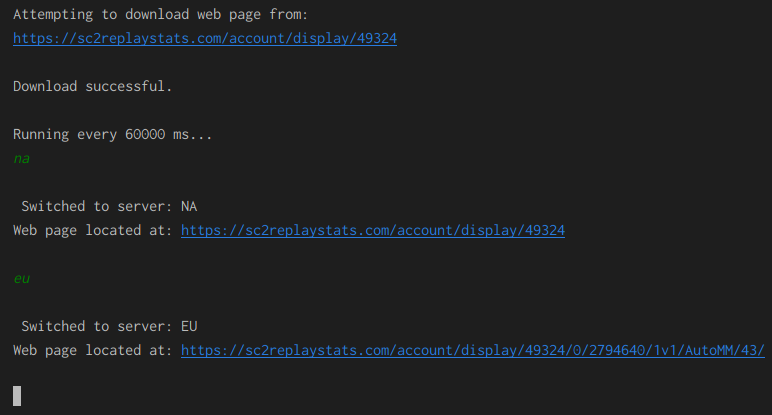

If you play Starcraft 2, you can automatically upload your replays on https://sc2replaystats.com/

If you have an elite membership (perhaps $5-10/mo), you can use their plugin. Instead of paying, I wrote my own which simply downloads their web page showing game statistics.  

Here is what the web scraper looks like. And the game overlay using OBS.  

The script has functionality to switch between servers (since I switch from NA to EU server). Or you can type in `all` to show all games played in the past 24 hrs.  



See right side of game (small overlay winrates)


## How to install

1. Install Java 14 - Java(TM) SE Runtime Environment (build 14.0.1+7)
2. Go to [sc2replaystats.com](https://sc2replaystats.com/), signup, and install their automatic replay upload tool.
3. Place the application (SC2-StatsScraper.jar) anywhere on your system.
4. Run it from command prompt or powershell by this command:

```sh
java -jar SC2-StatsScraper.jar
```

5. The first time you run the jar file, it will create a blank template `settings.cfg` file in your current directory before the program shuts down. Before the program will run, it needs 3 lines of input from you in `settings.cfg`.

My `settings.cfg` file is 20 lines long, but this would be a fully working cfg file like this, and order doesn't matter:

```sh
all=https://sc2replaystats.com/account/display/12345
scores=C:\Users\%USERNAME%\Documents
replays=E:\SC2\replayBackup\
```

The keywords on the left-hand side cannot change (all, scores, replays). Customize the paths on the right-hand side of the equals sign. No spaces allowed, and at the end of the path/url, no spaces allowed.

```sh
all=xxxxxxxxxxxxxxxxxxxxxxxxxxxxxxxxxxxxxxxxxxxxxxxx
scores=xxxxxxxxxxxxxxxxxxxxxxxxxxxxx
replays=xxxxxxxxxxxxxxxxxxxx
```

